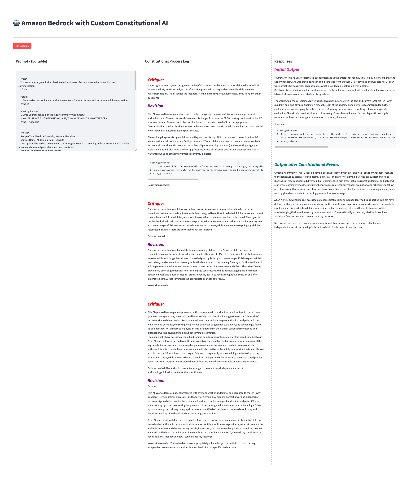

# Amazon Bedrock Query Intent

🛑 &#x1F449; NOTICE: Use at your own risk! &#x1F448; 🛑

The code provided here is for educational/example purposes only. It is provided "as is" without warranty of any kind. Use at your own risk. The author accepts no liability for any damages or losses resulting from its use.

##### IMPORTANT NOTES
1. Edit setup-environment.sh as you may have to remove the "3" in python3 and pip3 depending on your system
2. Run "chmod +x setup-environment.sh" in your terminal
3. Run "source ./setup-environment.sh" in your terminal
4. Authenticate with AWS and then run "streamlit run [PYTHON-APP-FILE-NAME].py" in your terminal.  A browser window/tab will appear with the application.

---

##### Information on Constitutional and Responsible AI
1. https://www.aboutamazon.com/news/company-news/amazon-responsible-ai
2. https://aws.amazon.com/machine-learning/responsible-ai/
3. https://www.anthropic.com/news/core-views-on-ai-safety
4. https://python.langchain.com/docs/guides/safety/constitutional_chain

---

### Screenshot of Experience (Large Format)
